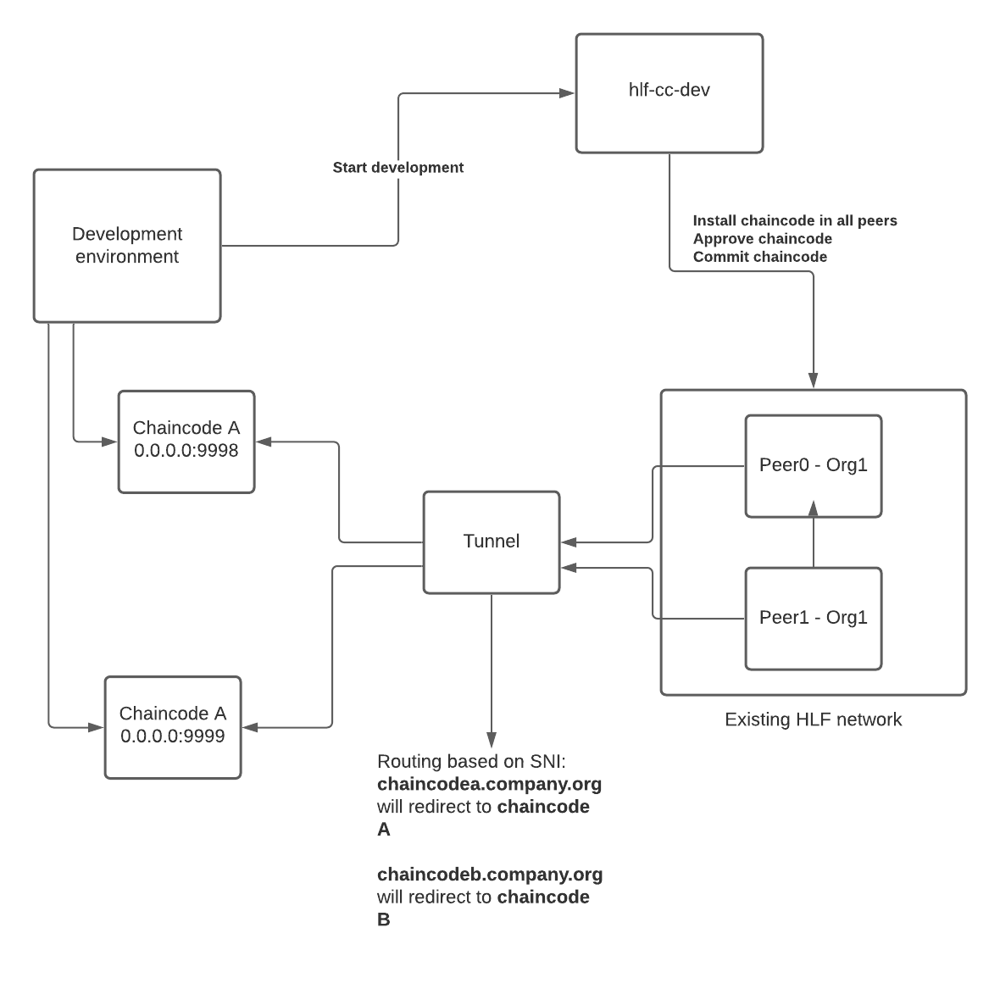
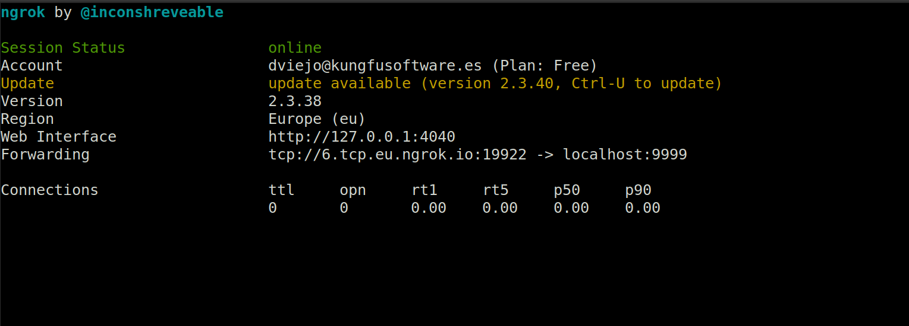

## What's `hlf-cc-dev`?

`hlf-cc-dev` is a tool to start developing a new chaincode from your development environment.

### Why does this tool exist?

When developing chaincodes, we need to have an HLF network deployed, usually in our development environment. It is hard for new developers to get started since they need to know how to deploy an HLF network.

This tool aims to ease the onboarding of new developers that are not familiar with the internals of the HLF network but are interested in developing chaincodes.

The only requirement is that the developer has access to a working HLF network. This network can be set up by Administrators that are used to perform these operations, so the developer doesn't need to.

With this tool, instead of installing the chaincode in the peers, approving the chaincode definition, and finally, committing the chaincode, the developer can have the chaincode started in its machine. With one command, it can install, approve and commit the chaincode in one go. SupposeThen, ifhe developer needs to modify the chaincode logic. In that case, all it needs to do is restart the chaincode program running in its machine, just like any other application the developer is used to developing.

### What you'll need

- A TLS/TCP tunnel to your local development environment (ngrok, getout, etc.)
- Hyperledger Fabric peer with external chaincode builder enabled.
- Network config with admin users for all of the organizations peers you will use.

## General diagram

The following diagram explains the architecture of the final solution



## Steps to get started

To start the server, you need the network config with the admin users for each organization.

```bash
hlf-cc-dev serve --address ":8080" --metrics-address ":8081" --config "<PATH_TO_NETWORK_CONFIG>"
```

## Start development in your local environment

You need to have a chaincode that's able to be deployed as an external service; you can take a look at the following templates:

- For Go (https://github.com/kfsoftware/hlf-cc-go-template)
- For Node.JS (https://github.com/kfsoftware/hlf-cc-node-template)
- **pending** For Java (https://github.com/kfsoftware/hlf-cc-java-template)

We recommend using the Go template since it's the easiest one to get started with.

Once you have the chaincode project set up on your local machine, you need to expose your server to the public; the easiest way to do this is to use a TLS/TCP tunnel, for example, [ngrok](https://ngrok.com/download).

```bash
ngrok tcp 9999 --region=eu # region can be us, eu, au, ap, sa, jp, in
```
The previous command will have this output:



Copy the Forwarding URL, but remove the `tcp://` part; for example, if you got `tcp://6.tcp.eu.ngrok.io:19922`, then you want to use `6.tcp.eu.ngrok.io:19922` for the following command(hlf-cc-dev).

After having exposed your chaincode server to the public, you can run the following command to trigger:

- Installation of the chaincode on the peers.
- Approval of the chaincode definition.
- Committing the chaincode definition.

```bash
CHAINCODE_NAME=template_go
API_URL="http://localhost:8080/graphql"
SIGNATURE_POLICY="OR('Org1MSP.member', 'Org2MSP.member')"
CHAINCODE_ADDRESS_TUNNEL="4.tcp.eu.ngrok.io:13438" # the forwarding URL you get from opening an ngrok tunnel
hlf-cc-dev start --localChaincode="localhost:9999" \
  --chaincodeAddress="${CHAINCODE_ADDRESS_TUNNEL}" \
  --chaincode="${CHAINCODE_NAME}" \
  --signaturePolicy="${SIGNATURE_POLICY}" \
  --env-file="${PWD}/.env" \
  --apiUrl="${API_URL}"
```

After the successful execution of the previous command, you can follow the instructions on the README.md for each template.

For example, for Go, you would run the following command:

```bash
source .env && go run ./main.go
```

Then you can go to http://localhost:8080/graphql and test the chaincode by running the following mutation:

```graphql
mutation invoke {
  invokeChaincode(input:{
    chaincodeName:"template_go"
    function: "InitLedger"
    args: []
    transientMap: []
  }){
    response
    transactionID
    chaincodeStatus
  }
}

mutation query {
  queryChaincode(input:{
    chaincodeName:"template_go"
    function: "GetAllAssets"
    args: []
    transientMap: []
  }){
    response
    chaincodeStatus
  }
}

```

If there are any issues you run into with the previous mutations, this can be because:
- The network config used to start the server is not correct.
- The users set up in the network config are not admins.
- The chaincode name is not valid.
- The chaincode function is not valid.

If after checking the previous things you still get an error, please, [you can open an issue](https://github.com/kfsoftware/hlf-cc-dev/issues/new)

